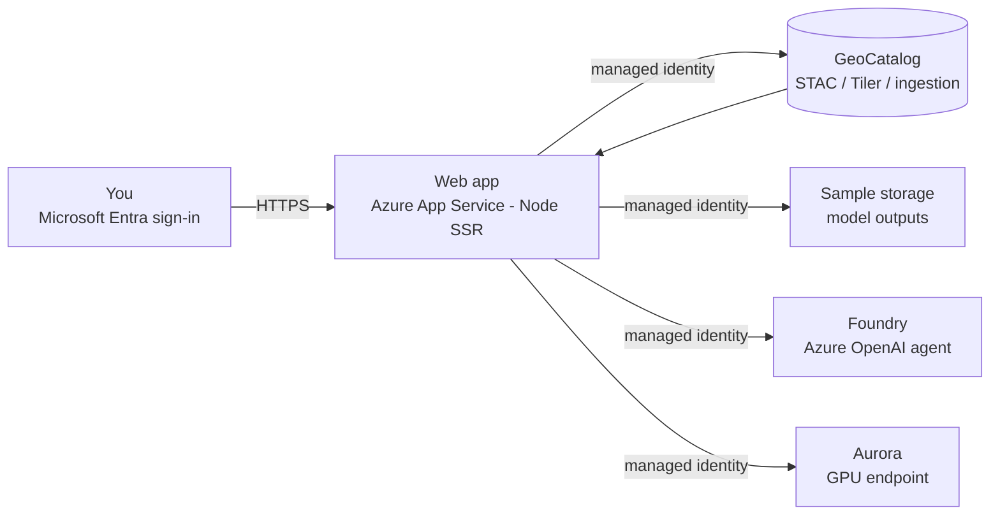

# Microsoft Planetary Computer Pro Rapid POC

A **turnkey Azure environment** for exploring
[Microsoft Planetary Computer Pro](https://github.com/Azure/microsoft-planetary-computer-pro):
a single **Deploy to Azure** button stands up a **GeoCatalog**, optional sample storage with
a scoped managed identity, an optional GeoAI **model plane** (Azure OpenAI + the Aurora
weather model), and an optional **web app** running on **Azure App Service (Linux, Node)**
that signs in with your Microsoft Entra identity and lets you browse, ingest, and visualize
your geospatial data.

The official Microsoft repo is *code* (notebooks, the Aurora storm-impact app, tools, and the
GeoAI SDK) and its quick-start expects you to bring a deployed GeoCatalog, blob storage,
identities, and a hand-edited `.env`. **This repo provisions those prerequisites** — the
landing zone — so you don't hand-build them for every POC, and it adds a first-class web app
so you don't need the raw portal or a notebook VM to see your data.

What the button deploys (pick the complete environment or only what you need):

- a **GeoCatalog** (the Planetary Computer Pro resource that stores, indexes, and serves your
  geospatial data using the open [STAC](https://learn.microsoft.com/azure/planetary-computer/stac-overview) standard),
- an optional **web app** on **Azure App Service (Linux, Node)** — a server-rendered React app
  that signs in with your Microsoft Entra identity and, through managed-identity backend
  routes, browses STAC collections, renders tiles on a map, and drives the ingest / GeoAI
  workflows against your GeoCatalog,
- an optional **sample-data storage account + user-assigned managed identity** for the secure
  managed-identity ingestion path (bring your own data),
- an optional **AI agent**, an **Azure OpenAI (Microsoft Foundry)** account + GPT model
  deployment (`gpt-5-mini` by default) for agentic / reasoning GeoAI scenarios against the
  GeoCatalog, key-less via managed identity, and
- an optional **Aurora weather model** on a **Foundry (Azure ML) GPU managed-compute
  endpoint**. The workspace + endpoint always deploy with this component; the GPU model
  deployment only runs when you supply a model asset ID and have A100 quota + accepted
  marketplace terms (so a default deploy never hard-fails on quota).

There is **no workstation VM and no public inbound access to manage** — the web app is a
managed Azure App Service reached over HTTPS, and every Azure data-plane call it makes uses
its **system-assigned managed identity**. This repo deploys and wires the environment; for
Microsoft's original notebooks and SDK, clone the
[official repository](https://github.com/Azure/microsoft-planetary-computer-pro) separately.

> **Primary scenario — weather for energy / oil & gas.** This POC is aimed at the **weather**
> use case: predicting a tropical storm's path with the **Aurora** AI weather model and
> assessing its impact on **energy / oil & gas infrastructure** (offshore platforms,
> refineries, pipelines, the power grid). The web app surfaces the storm-impact workflow
> (storm select → ECMWF via Planetary Computer Pro → Aurora inference on a Foundry GPU → model
> outputs to your storage → infrastructure-impact map), and the STAC browse + tile map prove
> that the ingest → render → visualize pipeline works.

> **Scope:** you can test the POC end to end **without the Aurora weather model** — deploy the
> GeoCatalog + web app (+ sample storage/identity, AI agent optional) and use the app to
> create a STAC collection, ingest sample Sentinel-2 imagery, apply render/mosaic config, and
> view it on the map. Aurora is only required for the advanced storm-impact workflow, which
> needs the **Aurora** model on a Foundry **GPU** endpoint (`Standard_NC24ads_A100_v4`):
> select the **Aurora weather model** component to provision the Foundry workspace + endpoint,
> then supply a model asset ID (the official app uses
> `azureml://registries/azureml/models/Aurora/versions/4`) and have GPU quota + accepted
> marketplace terms to deploy the model. See
> [Where Azure AI Foundry fits](#where-azure-ai-foundry-fits).

> **Superset of the storm app's own template.** The official repo ships a minimal
> `applications/storm_impact_assessment/deploy/azuredeploy.json` (GeoCatalog + storage + AI
> Foundry + Aurora endpoint). This template provisions **all of that plus** the web app and a
> managed-identity ingestion path, so **don't run both** — deploying this one already stands up
> everything the storm-impact workflow needs.

## Logical architecture

The GeoCatalog is the top-level container for geospatial data. The **web app** runs on a
managed **Azure App Service (Linux, Node)**, reached over HTTPS. Users sign in with their
**Microsoft Entra identity**; the app's **system-assigned managed identity** is granted the
data-plane roles it needs (GeoCatalog Administrator on the GeoCatalog, Storage Blob Data
Contributor on the sample storage, and Cognitive Services OpenAI User on the Foundry account),
so its backend API routes call the GeoCatalog STAC / Tiler / ingestion APIs, write model
outputs to storage, and invoke the GeoAI models **without keys or SAS**. The optional storage
account and user-assigned identity support the managed-identity ingestion path for your own
data.

This mirrors the Planetary Computer Pro reference architecture: public + private data flow
into the GeoCatalog (the enterprise STAC catalog), which then feeds downstream apps and GeoAI
models, using this POC's concrete components (every box is an Azure resource this template
provisions in your subscription; the AI agent and Aurora are optional):

[](deploy/azure/media/logical-architecture.png)



### Where Azure AI Foundry fits

The Planetary Computer Pro docs call this out directly: you can *"integrate data in Planetary
Computer Pro with Microsoft applications such as Fabric and Microsoft Foundry."* In the
reference architecture, the GeoCatalog is the **geospatial data plane** and Azure AI Foundry
is the **model plane**:

- **Model inputs**: the web app (or an agent) queries the GeoCatalog's STAC/Tiler/SAS APIs
  (authenticated with Microsoft Entra ID / managed identity) to pull imagery and metadata, and
  passes it to a GeoAI model hosted in Foundry (discriminative models like land classification
  and object detection, foundation models like Aurora for weather, or reasoning/agentic
  workflows on Azure OpenAI).
- **Model outputs**: the model's results (e.g., a land-cover raster or detected features) are
  written back to Azure Blob Storage as STAC items and **ingested into the GeoCatalog** through
  the same managed-identity ingestion path this POC sets up, so outputs become first-class,
  searchable layers alongside the source imagery.

This POC deploys the data plane (the GeoCatalog + ingestion) **and, optionally, the model
plane**: selecting the **AI agent** component provisions an Azure OpenAI (Foundry) account +
GPT deployment (key-less via managed identity), and selecting the **Aurora weather model**
component provisions a Foundry (Azure ML) workspace + GPU managed-compute endpoint, with the
GPU model deployment gated behind a model asset ID + quota so it never hard-fails.

When these components are deployed, the web app is configured with `FOUNDRY_ENDPOINT` /
`FOUNDRY_DEPLOYMENT` and `AURORA_ENDPOINT` app settings, and its managed identity is granted
**Cognitive Services OpenAI User** on the Foundry account. Deployment outputs also surface
`aiAgentEndpoint`, `aiAgentDeployment`, `auroraWorkspace`, `auroraEndpoint`, and
`auroraModelDeployed`.

## What this adds over the official repo

The [official Microsoft repository](https://github.com/Azure/microsoft-planetary-computer-pro)
ships the *code* (notebooks, the Aurora storm-impact app, tools, and the GeoAI SDK) and
assumes you already have the Azure infrastructure. This repo fills that gap:

| The official samples assume you have… | This repo provisions it |
| --- | --- |
| A deployed **GeoCatalog** | `Microsoft.Orbital/geoCatalogs` created by the button |
| A **place to explore the data** | A web app on Azure App Service (Entra sign-in, STAC browse, tile map, ingest/GeoAI workflows) |
| **Blob storage** for assets/outputs | Sample storage account + container |
| An **identity** wired to the GeoCatalog | Managed identities with data-plane roles, associated to the GeoCatalog |
| A **model plane** to run GeoAI | Optional Azure OpenAI (Foundry) agent + optional Aurora GPU Foundry endpoint |

Net effect: one **Deploy to Azure** button turns a set of prerequisites and a manual setup
guide into a ready-to-run environment, without forking or duplicating Microsoft's code, so
their samples stay the source of truth.

## Prerequisites: resource providers

| Provider | Used for |
| --- | --- |
| `Microsoft.Orbital` | The Planetary Computer Pro GeoCatalog |
| `Microsoft.Web` | The web app (App Service plan + site) |
| `Microsoft.Storage` | Sample-data storage account |
| `Microsoft.ManagedIdentity` | Ingestion managed identity |
| `Microsoft.CognitiveServices` | Azure OpenAI (Foundry) agent (optional) |
| `Microsoft.MachineLearningServices` | Aurora Foundry workspace + GPU endpoint (optional) |
| `Microsoft.KeyVault` | Backing key vault for the Aurora Foundry workspace (optional) |
| `Microsoft.Insights` | Application Insights dependency for the Aurora Foundry workspace (optional) |

Register `Microsoft.Orbital` before deploying (the portal auto-registers the others during
validation):

```bash
# Azure CLI
az provider register --namespace Microsoft.Orbital
```

```powershell
# PowerShell
Register-AzResourceProvider -ProviderNamespace Microsoft.Orbital
```

> **Preview regions:** GeoCatalog is available in **East US, North Central US, West Europe,
> Canada Central, UK South**, and US Gov Virginia. Deploy into one of these regions.

## Deploy to Azure

Click the button, sign in to the Azure portal, choose your components (GeoCatalog is always
deployed; add the web app and/or sample storage), pick the App Service plan SKU, and select
**Review + create**.

[](https://portal.azure.com/#create/Microsoft.Template/uri/https%3A%2F%2Fraw.githubusercontent.com%2FBalunywa%2Fplanetary-computer-pro-poc%2Fmain%2Fdeploy%2Fazure%2Fazuredeploy.json/createUIDefinitionUri/https%3A%2F%2Fraw.githubusercontent.com%2FBalunywa%2Fplanetary-computer-pro-poc%2Fmain%2Fdeploy%2Fazure%2FcreateUiDefinition.json)

[Visualize](http://armviz.io/#/?load=https%3A%2F%2Fraw.githubusercontent.com%2FBalunywa%2Fplanetary-computer-pro-poc%2Fmain%2Fdeploy%2Fazure%2Fazuredeploy.json)

> The GeoCatalog is the long pole; a typical deployment completes in about **10–20 minutes**
> (the deployment status may show "Created" before the GeoCatalog is fully ready). The App
> Service is created empty — publish the application code afterwards (see below).

## Publish the web app code

The template creates the **App Service** (Linux, Node) configured to build and start the app,
but it does **not** contain your application bits. Publish the `webapp/` folder once the
infrastructure is deployed. Oryx runs `npm install` + `npm run build` and the site starts with
`node server.mjs`.

```bash
# from the repo root
cd webapp
az webapp up --name <webAppName> --resource-group pcpro-poc-rg --runtime "NODE:22-lts"
```

`<webAppName>` and the site URL are in the `webAppName` / `webAppUrl` deployment outputs. You
can also wire CI/CD (GitHub Actions or Azure DevOps) to deploy `webapp/` on push.

## Deploy from the command line (optional)

```bash
az group create -n pcpro-poc-rg -l westeurope

az deployment group create -g pcpro-poc-rg -f deploy/azure/main.bicep
```

To deploy only the GeoCatalog (no web app, no storage):

```bash
az deployment group create -g pcpro-poc-rg -f deploy/azure/main.bicep \
  -p deployWebApp=false deploySampleStorage=false
```

To set the App Service SKU:

```bash
az deployment group create -g pcpro-poc-rg -f deploy/azure/main.bicep \
  -p appServiceSku=B1
```

### Sign-in (Microsoft Entra)

By default the deployment **registers the Entra sign-in app for you**. It uses the Microsoft
Graph Bicep extension, which runs as *you* (the person deploying), so no separate portal step
is needed — the app registration is created, its SPA redirect URI (`https://<app>/auth/callback`)
is set, and its client ID is wired into the web app's `ENTRA_CLIENT_ID` / `ENTRA_TENANT_ID`
settings automatically. **You must have rights to register apps** in the tenant
(**Application Administrator** or the **Application.ReadWrite.All** Graph permission).

> **If you don't have that role, the deployment fails at the app-registration step** with:
>
> ```
> {"error":{"code":"Forbidden","target":"/resources/entraApp",
>  "message":"Authorization_RequestDenied: Insufficient privileges to complete the operation..."}}
> ```
>
> Because the web app reads the registration's client ID, the failure cascades: the
> **App Service Plan is created but the web app (`Microsoft.Web/sites`) is never deployed**.
> This is a permissions issue, not a template bug. Fix it by redeploying with
> `autoRegisterEntraApp=false` — the site then deploys with sign-in left unconfigured
> (empty `ENTRA_CLIENT_ID`), and everything else (GeoCatalog, storage, managed identity,
> Foundry) provisions normally. Wire sign-in later once you have an app registration (see below),
> or ask an admin to grant you the role and rerun with auto-registration on.

If you can't (or would rather use an existing app registration), turn auto-registration off and
supply the IDs yourself — add your `https://<app>.azurewebsites.net/auth/callback` URL as a SPA
redirect URI on that app first:

```bash
az deployment group create -g pcpro-poc-rg -f deploy/azure/main.bicep \
  -p autoRegisterEntraApp=false entraTenantId='<tenant-guid>' entraClientId='<spa-client-guid>'
```

The deployment outputs `geoCatalogName`, `geoCatalogResourceId`, `geoCatalogUri`,
`webAppName`, `webAppUrl`, `sampleStorageAccount`, `sampleContainer`, `sampleContainerUrl`,
`ingestIdentityClientId`, `ingestIdentityObjectId`, `entraClientId`, `entraTenantId`,
`entraAppAutoRegistered`, and `entraRedirectUri`.

## Grant yourself access to the GeoCatalog

Data-plane operations (creating collections, ingesting, visualizing) require a **GeoCatalog
Administrator** role assignment on the GeoCatalog resource. The web app's managed identity is
granted this automatically; to browse or administer the catalog yourself, grant your own
identity too:

```bash
az role assignment create \
  --assignee "<your-object-id-or-upn>" \
  --role "GeoCatalog Administrator" \
  --scope "$(az resource show -g pcpro-poc-rg -n <geoCatalogName> \
              --namespace Microsoft.Orbital --resource-type geoCatalogs --query id -o tsv)"
```

## Use the web app

Open the `webAppUrl` from the deployment outputs in a browser. Sign in with your Microsoft
Entra identity (when `entraTenantId` / `entraClientId` are configured), then use the app to:

1. **Browse** your GeoCatalog's STAC collections and items.
2. **Visualize** imagery on a MapLibre tile map using the GeoCatalog's render + mosaic config.
3. **Ingest** sample Sentinel-2 imagery (create a collection, register the public Planetary
   Computer container as an ingestion source, ingest a few scenes, apply render/mosaic).
4. **Run the weather workflow** (when Aurora is deployed): pick a storm, pull ECMWF data via
   Planetary Computer Pro, run Aurora inference on the Foundry GPU endpoint, write model
   outputs to your `model-outputs` storage container, and map the storm track against energy /
   power infrastructure.

The app's backend API routes perform these operations server-side using the App Service
**managed identity**, so no keys or tokens are handled in the browser. The `GEOCATALOG_URI`
app setting is pre-filled with the resource's real `catalogUri` (including the
platform-assigned hash segment, `https://<name>.<hash>.<region>.geocatalog.spatio.azure.com`),
read directly off the GeoCatalog during deployment — nothing to paste. It is also emitted as
the `geoCatalogUri` deployment output.

### Where the sample data comes from

The sample-ingest flow does **not** copy imagery into your storage account, and your storage
account is **not** the GeoCatalog data source. The app's managed identity registers
**Microsoft's public Planetary Computer** as the ingestion source (via a short-lived SAS), then
tells the GeoCatalog to ingest a few Sentinel-2 scenes directly from it. No image bytes flow
through the app — it only orchestrates the API calls. The ingested items are stored in the
GeoCatalog's own managed storage.

The optional **sample storage account** (`deploySampleStorage`) is unrelated to GeoCatalog
seeding — it's where the **weather (storm-impact) workflow uploads its Aurora model outputs**
(to a `model-outputs` container). The web app's managed identity is granted **Storage Blob Data
Contributor** on this account, so outputs are written with managed identity — no account keys or
SAS. The container URL is surfaced to the app as `UPLOAD_CONTAINER_URL` /
`UPLOAD_CONTAINER_NAME`.

| | Source of sample imagery | GeoCatalog's stored copy | Deployed sample storage acct |
|---|---|---|---|
| **What** | MS Planetary Computer public blob | Catalog-managed storage (internal) | Your storage account |
| **Role** | Ingestion source (read via SAS) | Where ingested items live | Weather model-outputs target |
| **Who fills it** | Microsoft (already populated) | GeoCatalog ingestion engine | Storm-impact workflow (Aurora outputs, via MI) |

## Use your own data (managed-identity ingestion)

When you deploy the sample storage component, the template also creates a user-assigned managed
identity (`pcpro-ingest-identity`) with **Storage Blob Data Reader** on the sample container,
and **associates it with the GeoCatalog** for you, so the identity is ready for the
managed-identity ingestion path the official APIs use. To ingest your own assets:

1. Upload your COGs / rasters to the `sample-assets` container in the deployed storage account,
   and build STAC items for them.
2. Register the container as a **managed-identity ingestion source** using the deployment
   outputs `sampleContainerUrl` and `ingestIdentityObjectId`. The identity is already assigned
   to the GeoCatalog and already holds Storage Blob Data Reader on the container, so no extra
   role setup is needed. See
   [Set up an ingestion source using managed identity](https://learn.microsoft.com/azure/planetary-computer/set-up-ingestion-credentials-managed-identity).
3. Post your STAC items to the GeoCatalog Items API.

For Microsoft's original notebooks, SDK, and the storm-impact application source, clone the
[official repository](https://github.com/Azure/microsoft-planetary-computer-pro) separately —
this POC's infrastructure (GeoCatalog URI, storage, identities) satisfies its prerequisites.

## What data do *you* upload? (asset register vs. imagery)

A common point of confusion: **you do not upload the storm, the wind field, the impact scores,
or the alerts.** Those are produced by the app. There are two separate data planes, and as a
customer you normally only supply the first one.

### 1. Your asset register — the only thing most customers upload

This is your infrastructure estate: where your platforms, wells, pipelines, refineries, LNG
terminals, storage, and ports *are*, and how much each one matters. The app joins these
locations to a weather forecast track and computes exposure per asset. Upload it as **CSV**
(point assets) or **GeoJSON** ([IETF RFC 7946](https://datatracker.ietf.org/doc/html/rfc7946),
for line/area geometry like pipeline corridors and lease blocks). Coordinates are decimal
degrees, WGS 84 (EPSG:4326) — GeoJSON is `[longitude, latitude]` order per the RFC; CSV columns
are named `latitude` / `longitude` so order can't be confused.

Fields (only the first four are needed to place and score an asset):

| Column | Type | Meaning | Required |
| --- | --- | --- | --- |
| `id` | string | Unique asset identifier | Required |
| `name` | string | Operator-facing name | Required |
| `type` | enum | `offshore_platform`, `pipeline`, `well`, `refinery`, `lng_terminal`, `storage`, `port` | Required |
| `latitude` / `longitude` | number | Decimal degrees (WGS 84) | Required for point assets |
| `geometry` | GeoJSON | Line/polygon for corridors and areas (instead of a point) | Optional |
| `operator` | string | Operating company | Optional |
| `region` | string | Operating region | Optional |
| `business_unit` | string | Reporting business unit | Optional |
| `operating_status` | enum | `producing`, `reduced`, `shut_in`, `evacuating`, `standby` | Optional |
| `criticality` | enum | `standard`, `important`, `business_critical` | Drives risk weighting |
| `metadata` | object | Design wind speed, capacity, personnel on board, water depth, etc. | Optional |

Example CSV (point assets):

```csv
id,name,type,latitude,longitude,operator,region,operating_status,criticality
PLT-D7,Platform Delta-7,offshore_platform,27.62,-90.35,Meridian Energy,Central Gulf,producing,business_critical
WELL-1042,MC-252 #3,well,28.41,-89.42,Meridian Energy,Mississippi Canyon,producing,standard
REF-01,Port Arthur Refinery,refinery,29.87,-93.93,Meridian Energy,Gulf Coast,producing,important
```

Example GeoJSON (a pipeline corridor — a line, not a point):

```json
{
  "type": "Feature",
  "geometry": {
    "type": "LineString",
    "coordinates": [[-90.35, 27.62], [-90.10, 28.05], [-89.42, 28.41]]
  },
  "properties": {
    "id": "PIPE-17",
    "name": "Mars-Ursa Trunkline",
    "type": "pipeline",
    "operator": "Meridian Energy",
    "region": "Central Gulf",
    "criticality": "important"
  }
}
```

**How it becomes "impact."** The app pairs each asset with the active forecast track and scores
it purely from geography and attributes — nothing about the storm is uploaded by you:

```
your asset (lat, lon, type, criticality)  +  forecast track (lat, lon, wind, cone per hour)
      │  great-circle distance from asset to the forecast centerline
      │  forecast wind decays with distance from the storm core
      │  + rainfall, time-to-impact, storm intensity, inside-cone,
      │    your asset's criticality and type sensitivity
      ▼
   exposure score 0–100  →  level (normal → critical)  →  recommended actions & alerts
```

So the two things the engine needs *from you* are **where the asset is** and **how much it
matters**. Everything downstream (score, ranking, alerts, recommended pre-storm actions) is
computed, not uploaded.

### 2. Imagery / rasters — optional, and a different format entirely

The satellite/aerial basemap and any analytical rasters over your assets go through the
**GeoCatalog**, not the asset-register upload. That plane uses the geospatial community
standards, not CSV:

- **Pixels:** Cloud-Optimized GeoTIFF (**COG**) — a profile of the [OGC GeoTIFF 1.1
  standard](https://www.ogc.org/standard/geotiff/).
- **Metadata:** **STAC** items ([SpatioTemporal Asset Catalog](https://stacspec.org/); a STAC
  Item *is* a GeoJSON Feature, `stac_version` 1.0.0), posted to the GeoCatalog Items API.

This is the flow described in **[Use your own data (managed-identity
ingestion)](#use-your-own-data-managed-identity-ingestion)** above. It is **not required** for
the asset-to-storm risk logic — that needs only your asset locations plus the forecast track.

**Bottom line:** to see your estate scored against a storm, upload a **CSV/GeoJSON of your asset
locations**. COG + STAC imagery is a separate, optional layer that draws the picture under the
map.

### Ready-to-use sample files

Copy-paste starting points live in [`samples/`](samples/):

- [`samples/sample-assets.csv`](samples/sample-assets.csv) — 11 Gulf of Mexico point assets
  (platforms, wells, LNG terminal, refinery, storage, port) with the full column set.
- [`samples/sample-assets.geojson`](samples/sample-assets.geojson) — a `FeatureCollection`
  showing a point, a pipeline `LineString`, and a lease-block `Polygon` (RFC 7946, `[lon, lat]`).

Upload either from the app's **Asset Management** page to see assets placed on the map and scored
against the active forecast.

## What's in this repo

| Path | Purpose |
| --- | --- |
| `webapp/` | The web app — a server-rendered React app (TanStack Start + Vite) that signs in with Entra, browses STAC, renders tiles, and drives ingest/GeoAI workflows via managed-identity backend routes. Deployed to Azure App Service (Linux, Node) |
| `deploy/azure/main.bicep` | Bicep source that provisions the GeoCatalog, optional web app (App Service), and optional sample storage + ingestion identity, plus the optional AI agent + Aurora model plane |
| `deploy/azure/azuredeploy.json` | Compiled ARM template behind the **Deploy to Azure** button |
| `deploy/azure/createUiDefinition.json` | Portal form for the one-click deployment (component selection + App Service SKU + optional Entra IDs) |
| `deploy/azure/teardown.sh` | Deletes the resource group and everything in it |

## Security

- **No public inbound to manage:** the web app is a managed **Azure App Service** reached over
  HTTPS. There is no workstation VM, no RDP/SSH, and no VNet/Bastion to operate.
- The web app uses a **system-assigned managed identity** for every Azure data-plane call
  (GeoCatalog, storage, Foundry). The sample-data ingestion path uses a **user-assigned managed
  identity** scoped to **Storage Blob Data Reader** on the sample container only.
- User sign-in is **Microsoft Entra ID (MSAL)**; the `entraTenantId` / `entraClientId` app
  settings are public identifiers (not secrets). The Entra app is a single-tenant SPA that
  requests only `openid`/`profile`/`email` (delegated, no admin consent). It is registered at
  deploy time using the deployer's own Entra credentials — the template holds no app secret.
- App settings contain **no secrets**: storage and Foundry access use managed identity, and
  service URIs are public identifiers.
- GeoCatalog data-plane access is governed by Azure RBAC (**GeoCatalog Administrator** /
  **GeoCatalog Reader**). Grant least privilege.

## Tear down

Delete the resource group to remove everything (GeoCatalog, web app, storage, and all ingested
data):

```bash
./deploy/azure/teardown.sh pcpro-poc-rg
```

Equivalent one-liner:

```bash
az group delete -n pcpro-poc-rg --yes
```

## References

- [Microsoft Planetary Computer Pro documentation](https://learn.microsoft.com/azure/planetary-computer/)
- [Deploy a GeoCatalog resource](https://learn.microsoft.com/azure/planetary-computer/deploy-geocatalog-resource)
- [Use the APIs to ingest and visualize data](https://learn.microsoft.com/azure/planetary-computer/api-tutorial)
- [Manage access](https://learn.microsoft.com/azure/planetary-computer/manage-access)
